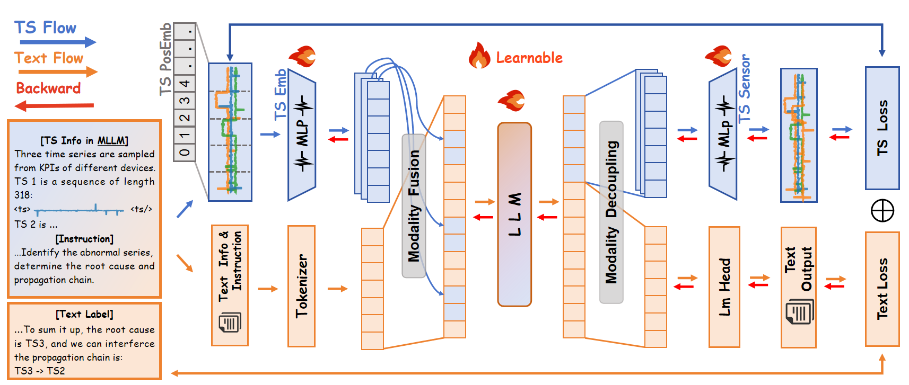

# TimeSense: Making Large Language Models Proficient in Time‑Series Analysis

[](LICENSE)
[](https://www.python.org/downloads/)

## 📖 Abstract

In the time-series domain, an increasing number of works combine text with temporal data to leverage the reasoning capabilities of large language models (LLMs) for various downstream time-series understanding tasks. This enables a single model to flexibly perform tasks that previously required specialized models for each domain. However, these methods typically rely on text labels for supervision during training, biasing the model toward textual cues while potentially neglecting the full temporal features. Such a bias can lead to outputs that contradict the underlying time-series context.

To address this issue, firstly, we construct the **EvalTS benchmark**, comprising 10 tasks across three difficulty levels, from fundamental temporal pattern recognition to complex real-world reasoning, to evaluate models under more challenging and realistic scenarios. We also propose **TimeSense**, a multimodal framework that makes LLMs proficient in time-series analysis by balancing textual reasoning with a preserved temporal sense. TimeSense incorporates a Temporal Sense module that reconstructs the input time-series within the model's context, ensuring that textual reasoning is grounded in the time-series dynamics. Moreover, to enhance spatial understanding of time-series data, we explicitly incorporate coordinate-based positional embeddings, which provide each time point with spatial context and enable the model to capture structural dependencies more effectively.

Experimental results demonstrate that TimeSense achieves state-of-the-art performance across multiple tasks, and it particularly outperforms existing methods on complex multi-dimensional time-series reasoning tasks.

## 🏛️ Model Architecture



*The TimeSense framework architecture showing the integration of temporal sense module and time series embedding with coordinate-based positional information for enhanced time-series understanding.*

## 🔥 Key Features

- **Temporal Sense Module**: Reconstructs input time-series within the model's context to preserve temporal dynamics
- **Coordinate-based Positional Embeddings**: Enhances spatial understanding of time-series data
- **EvalTS Benchmark**: Comprehensive evaluation suite with 10 tasks across three difficulty levels
- **State-of-the-art Performance**: Superior results on complex multi-dimensional time-series reasoning tasks
- **Multimodal Framework**: Balances textual reasoning with temporal understanding

## 📊 Repository Contents

This repository provides a complete implementation of TimeSense, including:

- **Model Training**: Complete training pipeline and scripts
- **Model Architecture**: TimeSense framework implementation with Temporal Sense module
- **Evaluation Data Generation**: Tools and scripts for generating evaluation datasets
- **EvalTS Benchmark**: Comprehensive evaluation dataset with 10 diverse tasks
- **Evaluation Code**: Assessment tools and metrics for performance evaluation

## 🏗️ Repository Structure

```
├── LICENSE                 # License file
├── readme.md              # This file
├── requirements.txt       # Python dependencies
├── demo/                  # Demo scripts and examples
├── evalts/               # EvalTS benchmark and evaluation tools
│   ├── gen_meta.py       # Metadata generation
│   ├── gen_qa.ipynb      # QA generation notebook
│   ├── gen_qa.py         # QA generation script
│   └── README.md         # EvalTS documentation
├── figures/              # Paper figures and visualizations
├── scripts/              # Training scripts
├── evaluation/           # Evaluation scripts and results 
└── timesense/            # TimeSense model implementation
```

## 🚀 Quick Start

### Installation

```bash
# git clone this repo
cd TimeSense
pip install -r requirements.txt
```

## 📈 EvalTS Benchmark

The EvalTS benchmark consists of 10 carefully designed tasks across three difficulty levels:

### Atomic Understanding
- Basic trend identification
- Simple feature identifiction

### Molecular Reasoning
- Multi-variate time-series analysis
- Complex pattern matching

### Compositional Tasks
- Multi-dimensional time-series reasoning
- Advanced tasks


## 📄 License

This project is licensed under the MIT License - see the [LICENSE](LICENSE) file for details.
